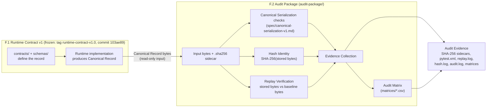

# Responsibility Boundary: F.1 Runtime Contract vs F.2 Audit Package

## F.1 owns

- The record definition: `contracts/runtime-contract-v1.json` and `schemas/`.
- Producing Canonical Records. F.1 is frozen. F.2 never edits F.1 files, and `tests/test_f1_boundary.py` pins their SHA-256.

## F.2 owns

F.2 takes Canonical Record **bytes** as its input. It then:

1. checks canonical serialization,
2. computes hash identity,
3. verifies replay,
4. collects evidence, and
5. maintains the audit matrices.

Its outputs are the Audit Evidence listed in the diagram.

## Rules at the boundary

- **F.2 never generates or modifies records.** It reads bytes, hashes them, compares them, and reports. The fixtures under `audit-package/fixtures/` are test inputs that are copied or spliced byte-for-byte from F.1 examples. They are not runtime output.
- F.2 never re-serializes a record, and it never regenerates a record in order to replay it.
- Rejections use only codes from `spec/rejection-reasons.json`.
- **Implementations vary; identity does not.** Any runtime (Python, Rust, Node, Go, …) may produce and check records in its own way. The SHA-256 of the stored bytes, the replay result, and the rejection code must be the same everywhere (see `rfc/RFC-AUDIT-001.md`).
