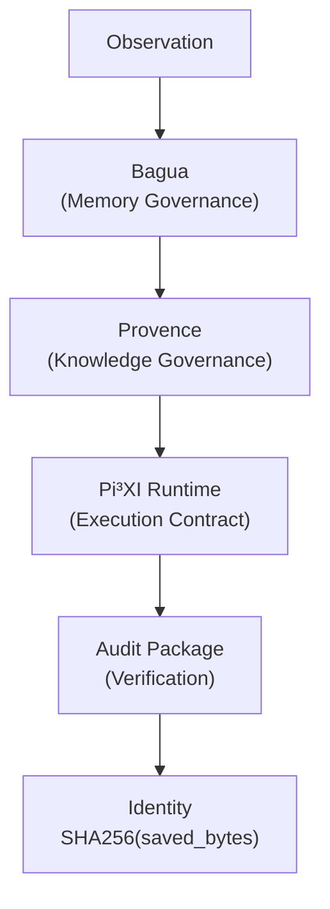
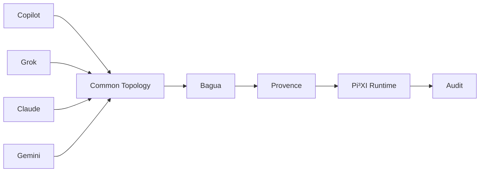

# Topology: Median Model Layers

| Field    | Value |
|----------|-------|
| Status   | **Informative** (non-binding) |
| License  | CC0 1.0 Universal (see repository `LICENSE`) |
| Related  | [`rfc/RFC-INVARIANT-001.md`](../rfc/RFC-INVARIANT-001.md), [`responsibility-boundary.md`](responsibility-boundary.md) |

This document is informative. It explains where the F.2 Audit Package sits in the larger design. It defines no requirements. The normative statements are in `rfc/RFC-INVARIANT-001.md` and `rfc/RFC-AUDIT-001.md`.

## Layer Topology

| Layer | Responsibility | State |
|-------|----------------|-------|
| Observation | Raw input from the world | Not a repository |
| Bagua | Memory governance | **Planned**; no repository yet |
| Provence | Knowledge governance | **Planned**; no repository yet |
| Pi³XI Runtime | Execution contract (F.1 Runtime Contract v1) | Frozen at tag `runtime-contract-v1.0` (commit `103ae89`) |
| Audit Package | Verification (F.2, `audit-package/`) | Draft v0.1 |
| Identity | `SHA256(saved_bytes)` of the stored record file | Defined in `spec/canonical-serialization-v1.md` |

**Naming note.** "Provence" is the intended proper name of the Knowledge Governance layer. It is not a misspelling of "Provenance".

## Model Independence

Different AI models (Copilot, Grok, Claude, Gemini, and others) may work on this system. They all work inside the same topology. The models may change, but the topology is preserved.

> 座標は変えてもよいが、不変量は保存する。
> (Coordinates may change, but invariants are preserved: models may change, topology is preserved.)

The audit result does not depend on which model produced or reviewed an artifact. Identity is `SHA256(saved_bytes)`, and the rules for replay and rejection codes are fixed by the spec, RFC-AUDIT-001, and the registry. They are not fixed by any model's output.

## See Also

- [`rfc/RFC-INVARIANT-001.md`](../rfc/RFC-INVARIANT-001.md): Median Model Invariants (I1 to I5)
- [`responsibility-boundary.md`](responsibility-boundary.md): F.1 / F.2 boundary
- [`rfc/RFC-AUDIT-001.md`](../rfc/RFC-AUDIT-001.md): Distributed Runtime Compatibility
